**Лабораторна робота №6**

**Тема:** Практичне використання Aggregation Framework у MongoDB

**Мета роботи:** Закріпити знання про основні стадії Aggregation Framework. Навчитися будувати ефективні агрегаційні запити. Освоїти методи фільтрації, групування, сортування та обробки масивів у MongoDB. Практично працювати з $match, $group, $sort, $unwind, $lookup, $project. Аналізувати продуктивність агрегацій та оптимізувати запити.

**Варіант 3**

1. **Встановлення MongoDB**

[Встановлення MongoDB](img/image.png)

2. **Встановлення MongoDB Compass**

[Встановлення MongoDB Compass](img/image1.png)

3. **Встановлення MongoDB Shell**

[Встановлення MongoDB Shell](img/image2.png)

4. **Створення нової колекції у mongosh**

[Створення колекції](img/image3.png)

6. **Основний синтаксис для роботи у mongosh**

Перегляд існуючих баз даних:

[Перегляд існуючих баз даних](img/image4.png)

Створення колекції:

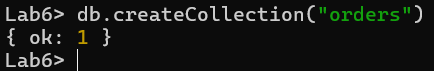

Перегляд існуючих колекцій:

[Перегляд існуючих колекцій:](img/image6.png)

Вставка документа:

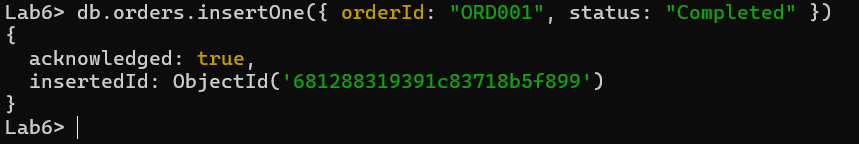

Отримання всіх документів колекції:

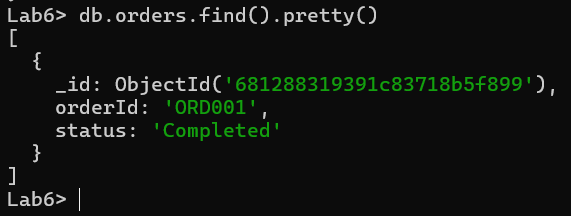

7. **Вихідні дані**

Колекція customers

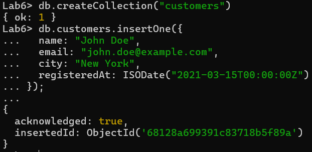

Колекція products

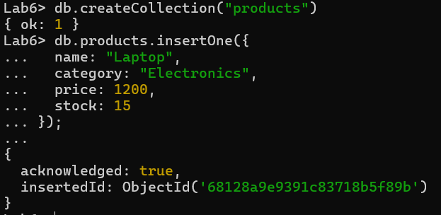

 Колекція orders

 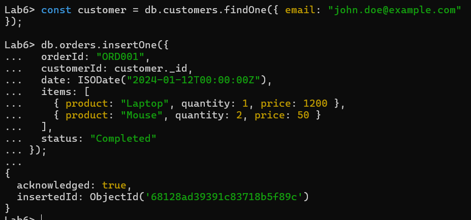

 8. **Завдання**

 Відфільтруйте замовлення за останні 3 місяці

 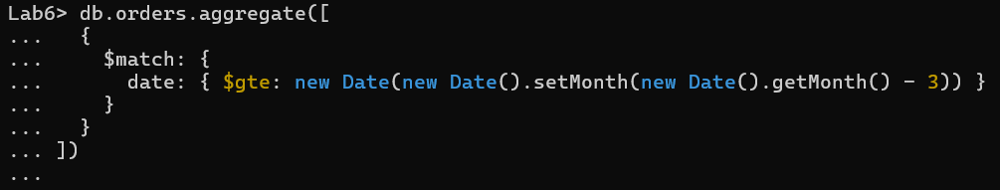

 Групування замовлень за місяцем

 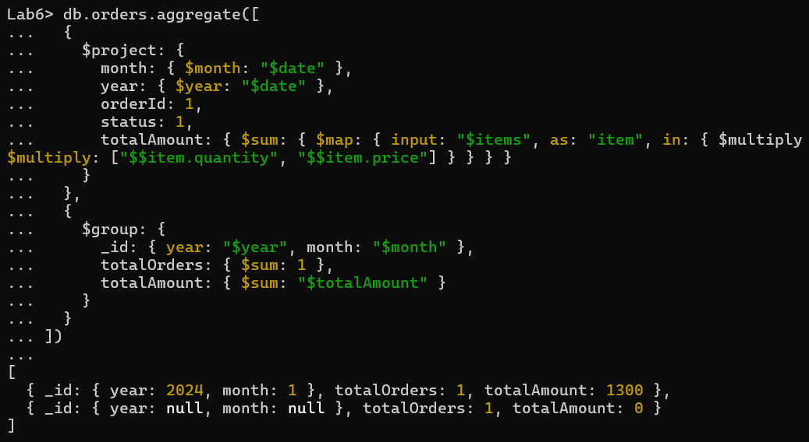

 Сортування за сумою замовлення

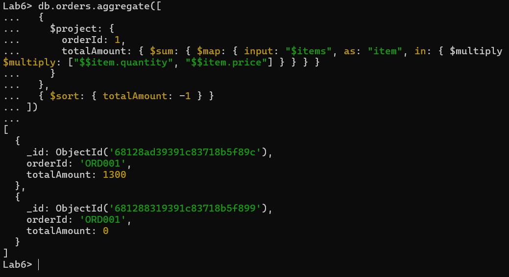

Розгорніть масив items у замовленнях

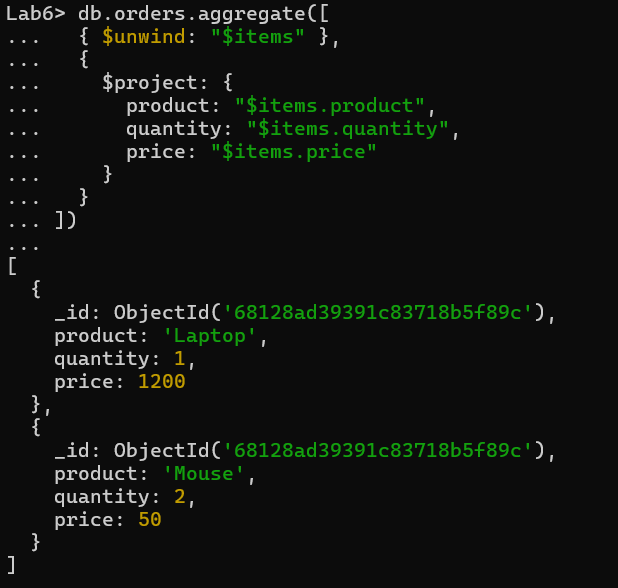

Підрахуйте кількість проданих одиниць товарів

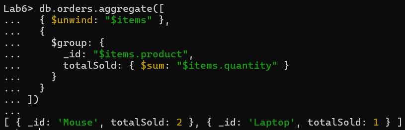

Отримання інформації про клієнтів у замовленнях

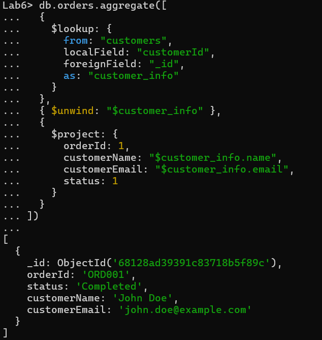

Визначте найбільш активних клієнтів

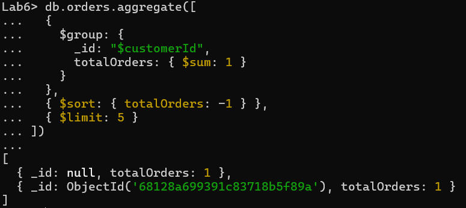

Перевірте продуктивність запиту

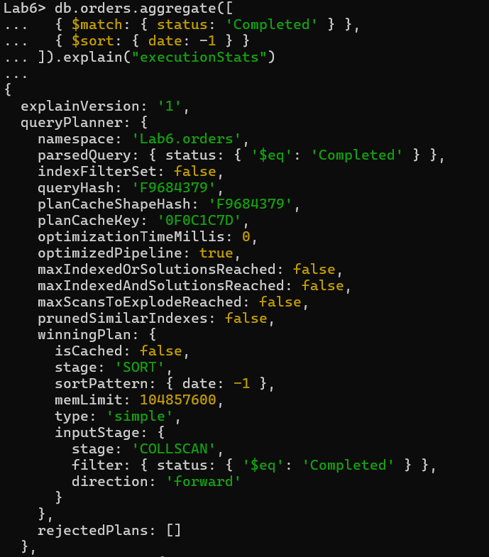

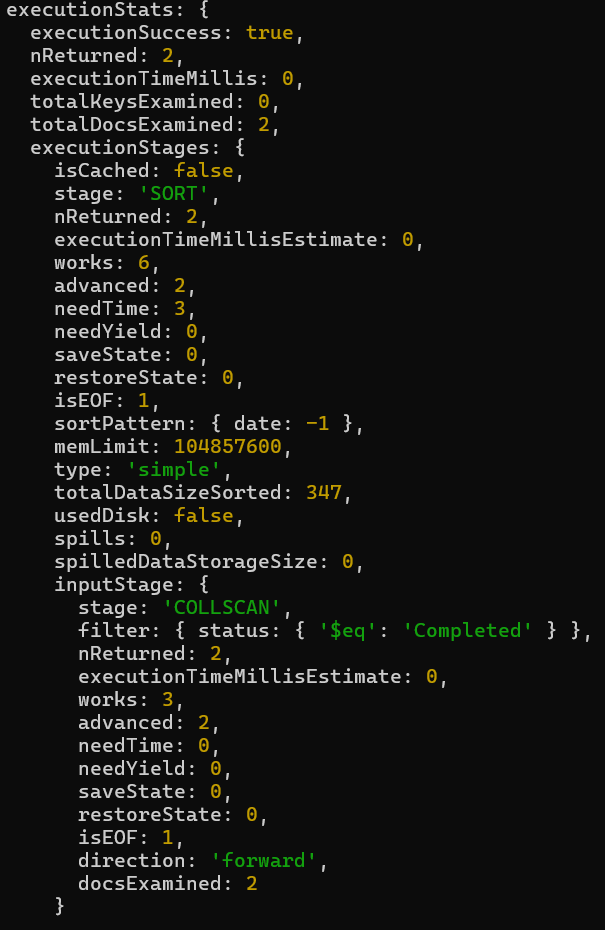

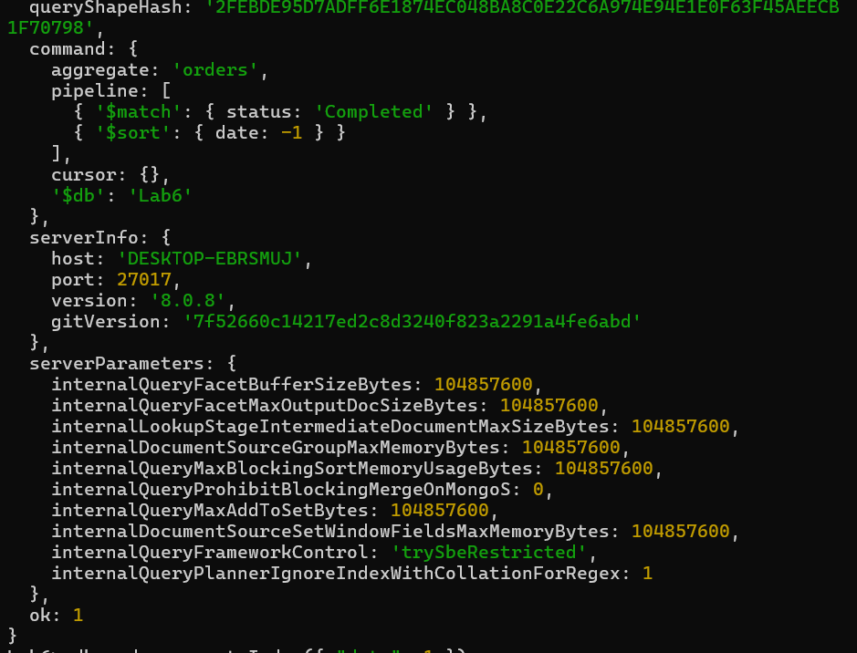

Оптимізуйте агрегаційний запит

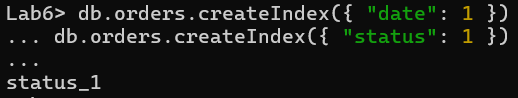

9. **Додаткові завдання**

Визначте категорії товарів із найбільшою кількістю продажів. Використайте $group для підрахунку загальної кількості проданих товарів за категоріями. Відсортуйте результат за спаданням.

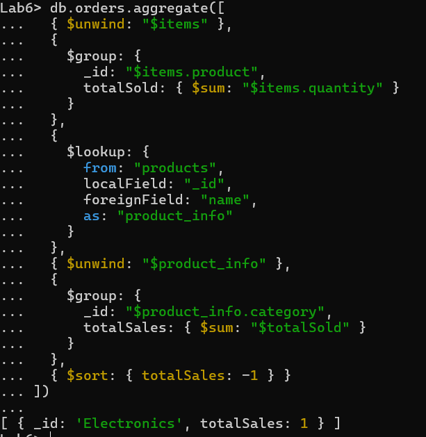

Розрахуйте середню ціну товарів у кожній категорії. Використайте $group для підрахунку середньої ціни товарів у кожній категорії.

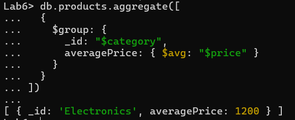

Знайдіть користувачів, які зробили більше одного замовлення. Використайте $group і $match, щоб знайти клієнтів, які мали більше одного замовлення.

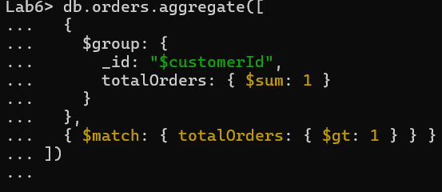