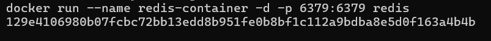
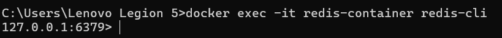
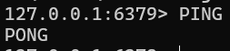
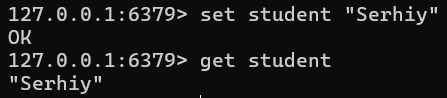
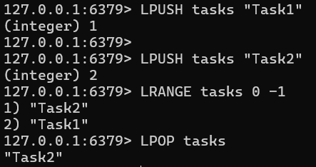

**Лабораторна робота № 8**

**Тема:** Робота з Redis

**Мета:** Закріпити розуміння роботи Redis та навчитися використовувати його основні можливості.

1. **Встановлення Redis та запуск**

Встановіть Redis на свій комп’ютер

Запустіть Redis Server

Підключіться до нього через redis-cli

Переконайтесь, що команда PING повертає PONG

2. Операції з рядками

Створіть ключ зі своїм ім’ям: SET student "<Ваше ім'я>".

Отримайте значення командою GET student.

Виконайте INCR mycounter (двічі) та перевірте його значення.

3. **Структури даних**

**Список (List):**
LPUSH tasks "Task1", LPUSH tasks "Task2"
LRANGE tasks 0 -1, LPOP tasks

LPUSH tasks "Task1"	додає "Task1" на початок списку з ключем tasks.

LPUSH tasks "Task2"	додає "Task2" перед "Task1".

LRANGE tasks 0 -1	повертає всі елементи списку (від 0 до останнього).

LPOP tasks	видаляє і повертає перший елемент списку.

**Множина (Set):**
SADD tech:set "Redis", SADD tech:set "PostgreSQL", SADD tech:set "MongoDB"
SMEMBERS tech:set, SISMEMBER tech:set "Redis"

SADD tech:set "Redis"	Додає елемент "Redis" до множини з ключем tech:set.

SMEMBERS tech:set	Повертає всі елементи множини.

SISMEMBER tech:set "Redis"	Перевіряє, чи є "Redis" елементом множини (1 — так, 0 — ні).

**Хеш (Hash):**
HSET profile name "<Ваше ім'я>", HSET profile city "<Ваше місто>"
HGET profile name, HGETALL profile

HSET profile name "Serhiy"	Створює хеш profile і додає поле name зі значенням "Serhiy".

HSET profile city "Kyiv"	Додає поле city до profile.

HGET profile name	Отримує значення поля name з хешу profile.

HGETALL profile	Отримує всі пари ключ–значення з хешу profile.

**Sorted Set:**
ZADD scores 85 "Student1", ZADD scores 92 "Student2", ZADD scores 74 "Student3"
ZREVRANGE scores 0 -1 WITHSCORES, ZRANK scores "Student1"

ZADD scores 85 "Student1"	Додає до множини scores студента з балом 85.

ZREVRANGE scores 0 -1 WITHSCORES	Виводить усіх студентів від найвищого до найнижчого з балами.

ZRANK scores "Student1"	Повертає позицію (ранг) "Student1" у зростаючому порядку за балами.

4. **Працюємо з TTL**
SET temp:data "Hello" EX 10
GET temp:data, TTL temp:data

SET temp:data "Hello" EX 10	Створює ключ temp:data зі значенням "Hello" і часом життя 10 сек.

GET temp:data	Повертає значення ключа (якщо ще не видалено).

TTL temp:data	Показує скільки секунд залишилось до автоматичного видалення.

5. **Міні-програма з Redis (додатково)**

[Міні-програма з Redis](lab8.py)

LPUSH — додає завдання на початок списку.

LRANGE — показує всі завдання.

RPOP — видаляє останнє завдання (з кінця списку).

6. **Аналіз даних (теоретичне завдання)**

**1.Кешування**
Redis часто використовується як кеш для збереження результатів запитів до бази даних, що дозволяє значно знизити час відповіді на запити, зменшуючи навантаження на основну базу даних.

Приклад використання:

Зберігання результатів складних SQL-запитів.

Кешування сесій користувачів.

Кешування статичних файлів (наприклад, HTML, JSON).

**2.Системи черг повідомлень (Queueing System)**
Redis підтримує структури даних, як списки та черги, що дозволяє будувати прості й ефективні системи обробки черг для асинхронних задач.

Приклад використання:

Обробка великих обсягів повідомлень (наприклад, в чатах чи системах підтримки).

Система обробки платежів або транзакцій в інтернет-магазинах.

Фонові завдання, які виконуються асинхронно.

**3.Системи лічильників і статистики (Counters)**
Redis дуже зручний для зберігання лічильників (наприклад, кількість переглядів сторінки чи кліків на банер), оскільки Redis підтримує атомарні операції для чисел.

Приклад використання:

Лічильники переглядів або кліків на веб-сайті.

Підрахунок кількості відвідувань певних сторінок.

Підрахунок балів або рейтингів користувачів.

**4.Підтримка сесій користувачів**
Redis часто використовується для зберігання сесій користувачів, оскільки він швидкий і дозволяє автоматично видаляти застарілі сесії за допомогою TTL (Time To Live).

Приклад використання:

Зберігання токенів аутентифікації.

Підтримка сесій у веб-додатках.

Зберігання тимчасових даних для користувачів.

**5.Реалізація механізмів публікації/підписки (Pub/Sub)**
Redis підтримує механізм Pub/Sub, що дозволяє розсилати повідомлення кільком підписникам одночасно. Це корисно для чатів, сповіщень або оновлення даних в реальному часі.

Приклад використання:

Чати в реальному часі.

Системи сповіщень (наприклад, коли змінився статус замовлення).

Оновлення даних у реальному часі для користувачів.

