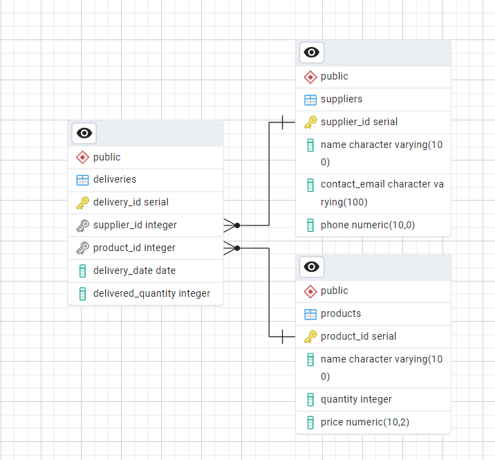

**Лабораторна робота № 1 Бази даних та інформаційні системи**

**Тема:** Ознайомлення з системами керування базами даних (СКБД) на прикладі PostgreSQL

**Мета:** Ознайомитися із базовими можливостями PostgreSQL як реляційної системи керування базами даних, закріплення теоретичних знань із основ реляційної моделі даних, створення та модифікація баз даних, а також виконання базових операцій SQL.

1. [Створення таблиць](create_table.sql): 
suppliers - таблиця з постачальниками 
products - таблиця з продуктами
deliveries - таблиця з поставками

2. [Додавання початкових даних](insert_date.sql)

3. [Операції над данними](date_operations.sql)

**Взаємодія між таблицями**

